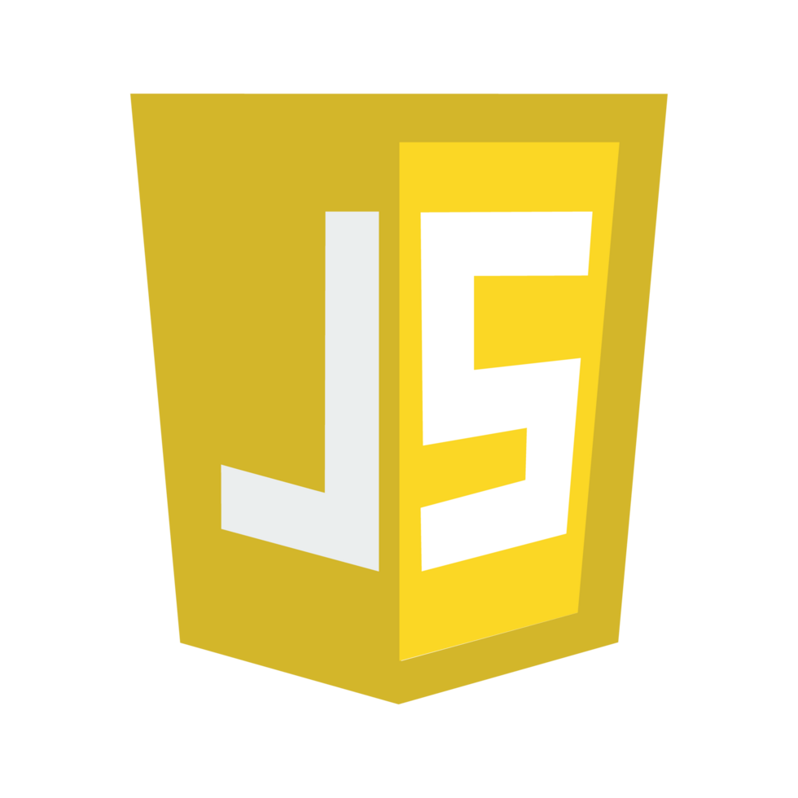
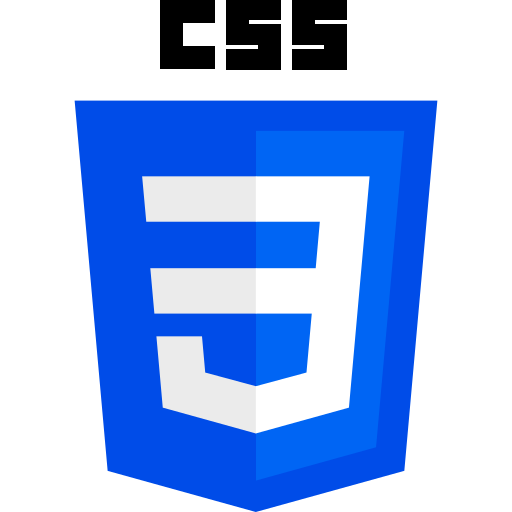

# Hi, I'm Louise Pessoa!👾 

- 💡 I’m studying at <c class="cesar" style="color: rgb(244, 117, 70);" href="https://www.cesar.school">Cesar School</c>

- 🌱 I’m a first-year student of Computer Science (Bachelor's Degree)
- 👀 I’m looking forward to collaborate on **creative, inovative and impactful** projects
- 📫 Contact me: <louisepessoaamds@gmail.com>
<!--
- 🤔 I’m looking for help with ...
- 💬 Ask me about ...
- ⚡ Fun fact: 
[CESAR School](https://www.cesar.school)
-->

<link href="style.css" rel="stylesheet"></link>

<a class="button" href="https://www.linkedin.com/in/louise-pessoa-">LinkedIn</a>

## Currently learning
- Python 
- JavaScript 
- HTML 
- CSS 
- C++ 
- Markdown 

#### Platforms I use to study
- Websites:
    - StackOverflow
    - W3Schools
    - beecrowd

- Editors:
    - Visual Studio Code
    - Arduino IDE

## Miscellaneous interests
- Movies🎬
- Volleyball🏐
- Hand crafts👐
